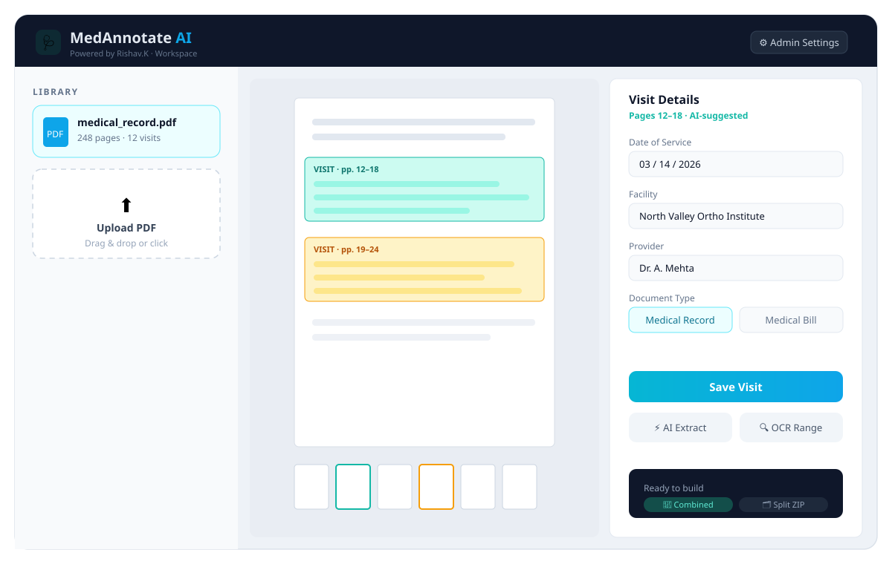
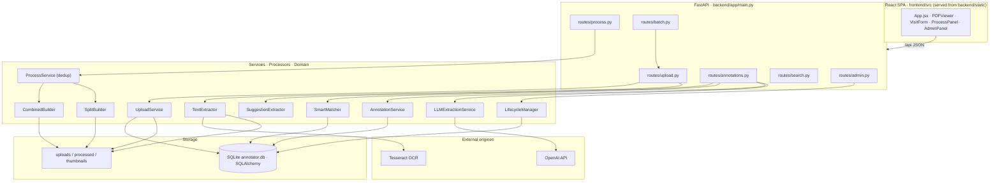
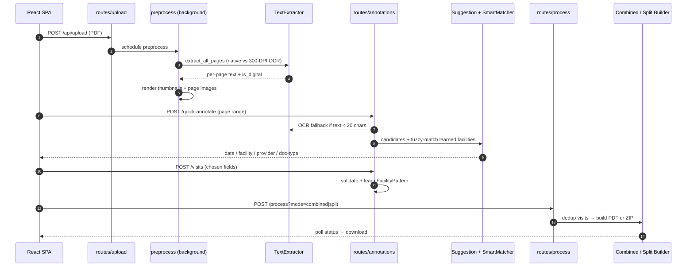
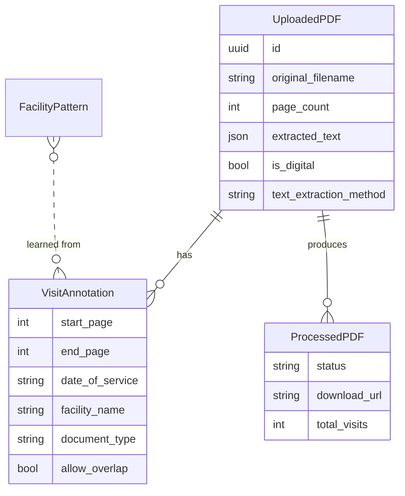

<div align="center">



# 🩺 MedAnnotate AI

### A local-first medical-PDF workflow — mark visits, auto-suggest fields, build court-ready records.

**Upload → Extract (native / OCR) → Annotate visits → Process → Download**

<br/>

[](https://medical-pdf-annotator.onrender.com)


<sub>Powered by <b>Rishav.K</b></sub>

</div>

---

## 🧭 What is MedAnnotate AI?

MedAnnotate AI is an enterprise-styled **medical-PDF workflow** for legal / medical-records staff (e.g. personal-injury case prep). Upload a large, multi-visit medical PDF; the backend extracts per-page text (native **or OCR** for scanned pages); you mark page ranges as **visits** and annotate each with date of service, facility, provider, and document type. The tool **suggests** those values by scanning the text — regex heuristics, a *learned-facility* fuzzy matcher, and an optional **OpenAI** call. Finished annotations are processed into either one **combined**, bookmarked, chronologically-ordered PDF, or a **split** ZIP of per-visit PDFs foldered by facility.

One FastAPI process serves both the JSON API and the pre-built React UI. The same codebase packages as a **desktop app** (PyInstaller/pywebview) or deploys as a **Docker web service**.

---

## ✨ Features

- 📄 **Native + OCR extraction** — pages with < 50 chars of real text are rasterized at **300 DPI** and passed through Tesseract; the doc is classified `digital / scanned / hybrid`.
- 🧠 **Smart suggestions** — regex candidate extraction (`auto_annotator`) + `difflib` fuzzy matching against a **learned facility table** that improves with every visit you save.
- 🤖 **AI extraction** — optional OpenAI JSON extraction of visit fields (`gpt-3.5-turbo`, via stdlib `urllib` — no SDK).
- 🧩 **Overlap-aware dedup** — each page is assigned to the earliest visit (unless overlap is allowed), surviving pages split into contiguous runs.
- 📑 **Two builders** — `Combined` (one PDF, 2-level facility→visit bookmarks, ordered by DOS) or `Split` (per-visit PDFs zipped, foldered by facility).
- ⚡ **Fast viewer** — page images pre-rendered at 150 DPI, served via cached Pillow LANCZOS resize.
- 🔐 **Safe ops** — audit log, orphan cleanup, retention policy, and a backup-then-wipe factory reset.

---

## 🏗️ Architecture



---

## 🔄 Data-flow pipeline



---

## 🧩 Tech stack

| Layer | Stack |
|---|---|
| **API** | FastAPI 0.109 · Uvicorn · Python 3.11 |
| **PDF/OCR** | PyMuPDF (`fitz`) · pytesseract + **Tesseract** · Pillow |
| **AI** | OpenAI Chat Completions over stdlib `urllib` |
| **Storage** | SQLAlchemy 2 · SQLite (WAL) + on-disk uploads/processed/thumbnails |
| **Frontend** | React 18 · Vite · Tailwind · lucide-react (built into `backend/static`) |
| **Deploy** | Docker on Render (apt-installs `tesseract-ocr` so OCR works server-side) |

---

## 🗃️ Data model



---

## 📡 API (selected)

| Method | Path | Purpose |
|---|---|---|
| `POST` | `/api/upload` | Upload PDF → schedule preprocess |
| `GET` | `/api/pdf/{id}/page/{n}/image` | Rendered page PNG (zoom-cached) |
| `POST` | `/api/pdf/{id}/quick-annotate` | Regex + learned-facility suggestions (auto-OCR fallback) |
| `POST` | `/api/pdf/{id}/ai-annotate` | OpenAI structured field extraction |
| `POST` | `/api/pdf/{id}/quick-ocr` | Force OCR on a page range |
| `POST` | `/api/pdf/{id}/visits` | Create a visit (validate + learn) |
| `POST` | `/api/pdf/{id}/process` | Build `combined` / `split` (async) |
| `GET` | `/api/process/status/{job}` · `/api/download/{job}` | Poll · download |
| `GET` | `/api/pdf/{id}/search` | Full-text search over extracted text |
| `GET` | `/api/admin/storage-stats` · `/api/admin/factory-reset` | Ops |

---

## 🚀 Getting started

```bash
# backend
cd backend
pip install -r requirements.txt          # server: requirements-server.txt
python run.py                             # http://localhost:8000

# frontend (new terminal)
cd frontend
npm install && npm run dev                # http://localhost:5173 (proxies /api)
npm run build                             # emits to ../backend/static
```

### Docker (with OCR)

```bash
docker build -t medannotate .            # installs tesseract-ocr + eng
docker run -p 10000:10000 medannotate
```

---

## ☁️ Deployment (Render)

Docker web service via `render.yaml`. The image `apt-get install`s `tesseract-ocr` + `tesseract-ocr-eng` (which is *why* it's Docker, not native Python), installs `requirements-server.txt` (desktop-only `pywebview`/`pyinstaller` excluded), and serves the committed `backend/static` bundle from FastAPI.

- **AI extraction** needs your **OpenAI API key** entered in the app's Admin Settings.
- On the **free tier**, uploads + the SQLite DB are on ephemeral disk (reset on restart).

---

<div align="center">
<sub>MedAnnotate AI · Powered by <b>Rishav.K</b> · FastAPI + React + Tesseract</sub>
</div>
